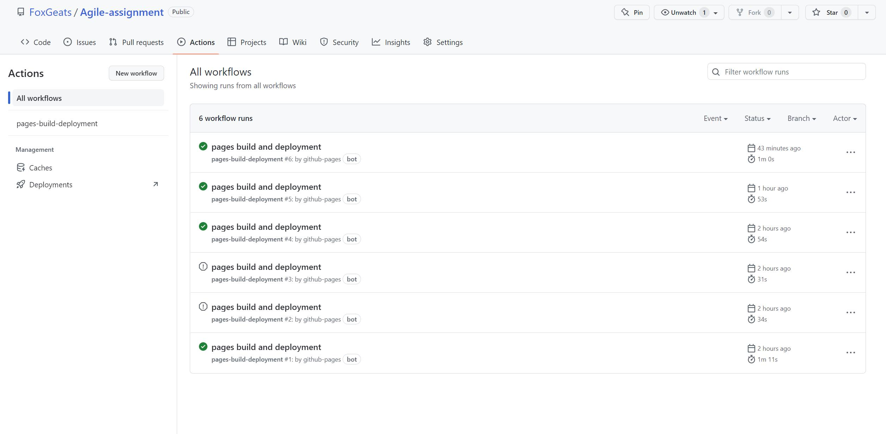
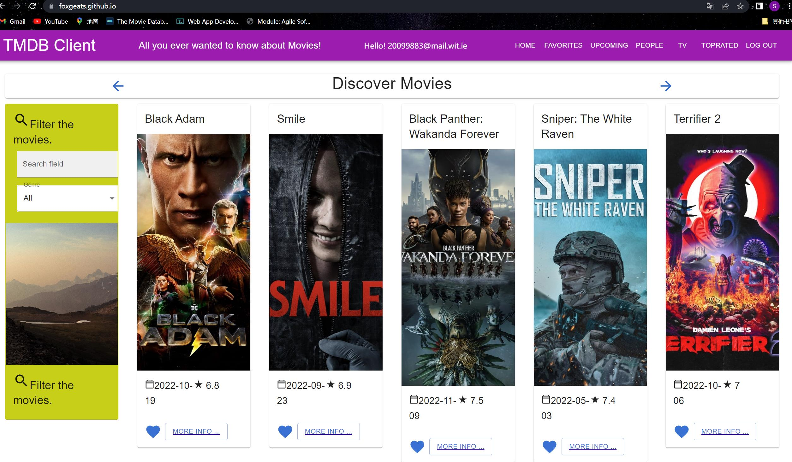
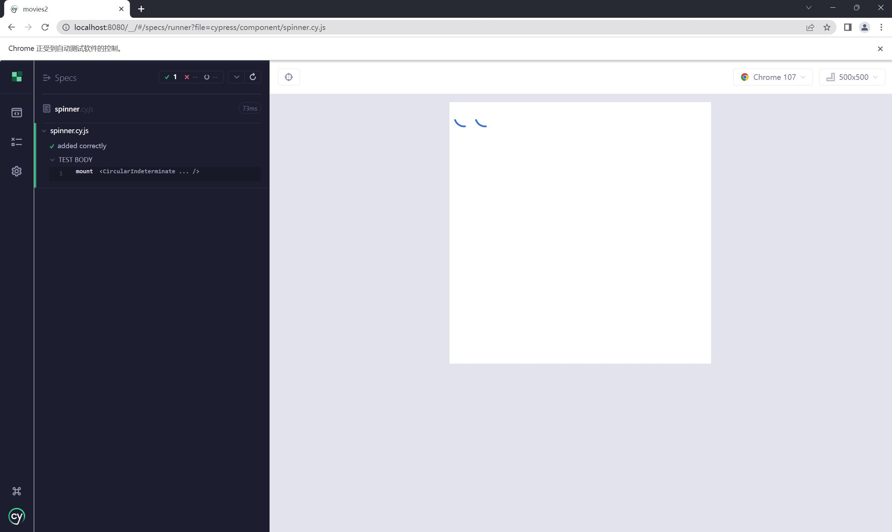

# Assignment 1 - Agile Software Practice.

## Name: Shu Chen
This repository contains the implementation of a React App and its associated Cypress tests and GitLab CI pipeline.

## React App Features.

+ Add the Top Rated Movies Page.
+ Add the People page.  
+ Add the Person Details Page.  
+ Full Caching support.  
+ Full pagination support.  
+ Add Firebase Authentication for Log in/Sign Up/Reset and each header.  
+ Auto-Deploy to [GitHub](https://FoxGeats.github.io/Agile-assignment).  
+ Code Splitting Support. 

## Automated Tests.

### Base test cases.
+ [cypress/e2e/base.cy.js](cypress/e2e/base.cy.js)
+ [cypress/e2e/actor.cy.js](cypress/e2e/actor.cy.js)
+ [cypress/e2e/login.cy.js](cypress/e2e/login.cy.js)
+ [cypress/e2e/pagination.cy.js](cypress/e2e/pagination.cy.js)
+ [cypress/e2e/review.cy.js](cypress/e2e/review.cy.js)

### Cypress Custom commands
+ [cypress/support/commands.js](cypress/support/commands.js)
+ [cypress/e2e/login.cy.js](cypress/e2e/login.cy.js)

## Code Splitting.  

### Route-based Code Splitting  
+ [src/index.js](src/index.js)  

## Pull Requests.

### GitHub  
[https://github.com/FoxGeats/Agile-assignment.git](https://github.com/FoxGeats/Agile-assignment.git)  

### GitLab  
[https://gitlab.com/agile40/agile-assignment](https://gitlab.com/agile40/agile-assignment)

## Independent learning.  

### Auto-deployment on GitHub and AWS Amplify  
You can access this movie app through [GitHub](https://FoxGeats.github.io/Agile-assignment) anytime.

For Github deployment, I followed the document from [create react app](https://create-react-app.dev/docs/deployment/).  

### Component Tests  
Have tried to use the component [test](cypress/component/spinner.cy.js) from cypress for component [spinner](src/components/spinner/index.js), inspired by the document from [web](https://docs.cypress.io/guides/component-testing/react/quickstart).  

## Other related links and things  
### Online Demo
GitHub: https://FoxGeats.github.io/Agile-assignment

### Video Demo  
Youtube: https://www.youtube.com/watch?v=jn4wn8NK3m8
